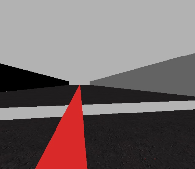
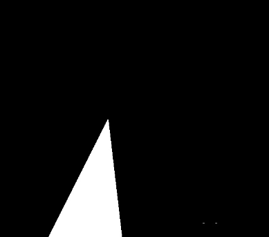
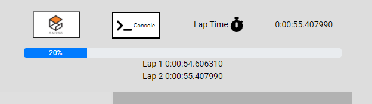

# Práctica 1 - Seguimiento de línea

El objetivo de la práctica es la realización de un formula 1 robótico que recorra un circuito dado siguiendo una línea roja dada.


## Primeros pasos

Tenemos que tener algunos comandos a mano antes de empezar:

* Obtención de imágenes

  ```python
  HAL.getImage()
  ```

* Mostrar imágenes

  ```python
  GUI.showImage(imgage)
  ```

* Control de la velocidad de rotación

  ```python
  HAL.motors.sendV()
  ```

* Control de la velocidad de avance

  ```python
  HAL.motors.sendW()
  ```

## 21/03/06

Tenemos la siguiente imagen



Y queremos detectar la posición de la línea roja

Antes de poner en marcha el coche vamos a implementar una detección de color rojo. Para no probar valores sin mucho conocimiento se ha consultado [este tutorial](https://medium.com/@gastonace1/detecci%C3%B3n-de-objetos-por-colores-en-im%C3%A1genes-con-python-y-opencv-c8d9b6768ff) donde aparecen los valores para la detección de color rojo.

En concreto los valores que usan son (170, 100, 100) y (179, 255, 255) como rango de colores. Con estos valores se obtiene una imagen completamente oscura. Vamos a modificar los valores de la componente H para coger todo el espectro de tonalidades rojas hasta conseguir este resultado:



Tenemos algunos puntos que no corresponden a la línea roja que queremos seguir, por ello vamos a aplicar apertura y cierre en la imagen para eliminar el ruido y así limpiar la imagen.

Para optimizar el proceso se realiza la detección sólo en un conjunto de 11 filas partiendo desde el 60% de la altura (el cero de la imagen está en la parte superior).


Con esto ya podemos hacer un pequeño __control proporcional__ sobre la velocidad angular con una constante `Kp = 0.005`.

Con este control proporcional y una velocidad cte durante todo el circuito de 1 se consigue un tiempo de `1min 36s` aunque no ha sido capaz de repetirlo en una segunda vuelta debido a la sobreoscilación.

Es más estable con una velocidad de 0.7 aunque supone aumentar el tiempo por vuelta hasta los `2min 28s y 2min 20s`

> Este tiempo está lejos del objetivo de la práctica

Si se sube la velocidad a `1`y se baja la cte Kp a `0.001` el sistema es capaz de recuperar, aunque se separa de la línea demasiado durante las curvas. Con estos valores se consigue un tiempo de `1min 36sy 1min 39s `.

Viendo que la mejora al tocar la cte Kp es notable se prueba con un valor de `0.0025`. Con este valor y una velocidad de `1` se consigue una mantener el coche con mayor estabilidad sobre la línea roja, aunque el tiempo apenas varía (`1min 35s`).


Subiendo la velocidad a `1.2` con Kp 0.0025 se consigue un tiempo de `1min 19s`aunque las oscilaciones en algunas curvas son demasiado elevadas.


## 21/03/07

Si guardamos la posición dos instantes antes podemos comparar dicha posición con la posición actual y de esta forma saber si estamos en curva o en recta. Esto nos permite acelerar en las rectas llegando a mejorar mucho los tiempos. Sin embargo el cambio entre recta y curva es demasiado brusco. Esto se puede mejorar con un controlador proporcional para la velocidad.

Aplicando el control proporcional sobre la velocidad de forma constante, sin diferenciar entre rectas y curvas se consigue un tiempo de 45s (`este resultado fue aleatorio y no pudo repetirse`)


Si además del control proporcional se aplica un control derivativo para el giro se mejora la respuesta en las curvas. Además, al hacer un control proporcional de la velocidad en las curvas se consigue una mejor adaptación a la línea.

Actualmente el sistema tiene:

* Capacidad para diferenciar entre curva y recta
* Control proporcional del giro para las rectas
* Control proporcional derivativo del giro en las curvas
* Control proporcional de la velocidad en las rectas
* Control proporcional de la velocidad en las curvas 

Con este sistema se consigue un tiempo de `53s` aunque sigue teniendo problemas con sobreoscilaciones en algunas curvas.


## Errores encontrados

1. El tiempo por vuelta se congela cuando se hace la prueba durante varias vueltas. En ocasiones no se muestra el tiempo

   