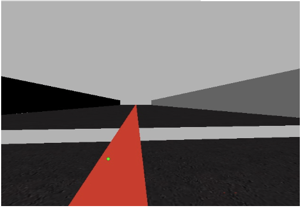

# Práctica 1 - Seguimiento de línea

El objetivo de la práctica es la realización de un formula 1 robótico que recorra un circuito dado siguiendo una línea roja dada. Para realizar la práctica es necesario seguir la [guía de instalación](instalation.md) además de tener un equipo con potencia suficiente para ejecutar [Gazebo](http://gazebosim.org/). Los datos que se muestran en esta práctica se han obtenido con un procesador _i7-8700K a 4,7Ghz con 6 núcleos/12hilos_.

## Primeros pasos

Se deben tener algunos comandos a mano antes de empezar:

* Obtención de imágenes

  ```python
  HAL.getImage()
  ```

* Mostrar imágenes

  ```python
  GUI.showImage(image)
  ```

* Control de la velocidad de rotación

  ```python
  HAL.motors.sendW()
  ```

* Control de la velocidad de avance

  ```python
  HAL.motors.sendV()
  ```

## Solución propuesta

Tras probar dos posibles soluciones, se decide usar un modelado del sistema por medio de la pendiente que forma el centroide de la franja de recta detectada con el píxel central inferior de la cámara. Esto permite calcular el ángulo que debe girar el F1 para llegar a la línea.

Al cálculo de la línea hay que añadirle un control PD, aunque podría valorarse un control PID, la parte integral no es necesaria para el ejercicio propuesto.


### Imagen inicial

Antes de realizar el cálculo de la pendiente es necesario obtener la imagen que nos permitirá localizar la recta. Para ello se deben utilizar la función _getImage_ del módulo __HAL__. Para mostrar la imagen en la interfaz gráfica (_GUI_) se emplea la función _showImage_ del módulo __GUI__.

> El código sería el siguiente:
>
> ```python
> img = HAL.getImage()
> GUI.showImagen(img)
> ```


### Procesamiento de imagen y obtención del centroide

Una vez obtenida la imagen se debe detectar la línea de color rojo. El vehículo debe seguir esta línea lo más fielmente posible, para ello se emplea una máscara de color rojo con OpenCV. Es importante usar los rangos adecuados, ya que se debe obtener todo el rango de colores rojos. Primero se debe pasar la imagen a HSV, ya que será más fácil restringir el rango de colores. Para tomar unos valores de inicio se ha consultado este [tutorial](https://medium.com/@gastonace1/detecci%C3%B3n-de-objetos-por-colores-en-im%C3%A1genes-con-python-y-opencv-c8d9b6768ff). Aplicando la máscara de color para los rangos (10, 100, 100) - (170, 255, 255) se obtiene la siguiente imagen:


En la imagen obtenida tras aplicar la máscara se pueden apreciar algo de ruido debido al morro del vehículo, para eliminarlo se aplican dos erosiones y dos dilataciones.

Como se aprecia en la imagen, los valores dentro del rango son de color blanco, por tanto, se puede obtener el centroide de la línea como el centroide del contorno. Como se aprecia en la siguiente imagen, el centroide del contorno de toda la línea se encuentra cerca del coche. Debido a que se quiere controlar la dirección del vehículo es necesario obtener el centroide en un punto cercano al horizonte.



Se llega a la idea de aplicar la detección de contorno sólo en una franja cercana al horizonte. En concreto se calcula el contorno al 45% &mnplus; 3px de la altura total desde la parte inferior, es importante recordar que las imágenes tienen su origen en la esquina superior izquierda. De esta forma se consigue un centroide de la línea en una posición alejada


### Sistema de control

Para realizar el control del giro del vehículo se debe tener en cuenta cuanto dista el centroide calculado del centro del vehículo. Hay que recordar que la cámara no se encuentra centrada en el vehículo, sino que se encuentra desplazada hacia la izquierda. Por simplificar el sistema de control se va a considerar que el centro del coche coincide con el centro de la cámara.

Para calcular el ángulo de giro que debe realizar el coche se debe calcular la pendiente entre dos puntos. El primer punto será un punto fijo de la imagen, este será la referencia a nuestro vehículo. El segundo punto será el centroide de la recta. 


> (1) Pendiente de la recta: m = (y_2-y_1)/(x_2-x_1)
> 
> (2) Ángulo de la recta con la horizontal:&#593; =arctg(m)


Aplicando las ecuaciones (1) y (2) se consigue el ángulo &#593;. Este ángulo será el giro que debe efectuar el vehículo. Por ejemplo, en la siguiente curva, se vería el ángulo &#593; representado.


Una vez obtenido el ángulo de giro se procede a la creación del sistema de control.

#### Control Proporcional

Es el sistema de control más sencillo posible. En este caso se va a controlar el giro del vehículo conforme al ángulo de giro calculado pero se va a multiplicar por una constante __Kp__. De esta forma se tendría el siguiente código:

```python
giro = Kp * alpha
```

Se debe ir modificando el valor de __Kp__ hasta conseguir un valor que permita completar una vuelta al circuito, para ello hay que tener en cuenta:

* Valores de _Kp_ elevados harán un control muy brusco y por tanto el vehículo oscilará sobre la línea.
* Valores de _Kp_ bajos harán un control muy suave y, por tanto, el vehículo tardará mucho en llegar a la línea.

Con este sistema tan sencillo se puede dar una vuelta completa al circuito a velocidades bajas.

#### Control Proporcional Derivativo

Además de tener en cuenta el ángulo que debemos girar en el instante actual, se puede tener en cuenta el ángulo que ha girado en el instante anterior, de esta forma se tendría un control derivativo. Para ello hace falta almacenar el giro de la iteración anterior. El control derivativo incrementa o disminuye el giro si aumenta o disminuye el ángulo a girar respecto de la iteración anterior. Con este tipo de control se consigue suavizar el control proporcional. Para este caso se tendría el siguiente código:

```python
giro = Kp * alpha + Kd * (alpha - alpha_last)
```

#### Control proporcional de la velocidad

Una vez conseguido un sistema de control de giro, en vistas a mejorar el tiempo por vuelta, se va a realizar un pequeño control proporcional de la velocidad. Este control proporcional disminuirá la velocidad en función del ángulo girado de forma qué a mayor giro menor velocidad.

```python
velocidad = velocidad_maxima - Kp_v * alpha
```

### Test

Una vez se tienen los tres sistemas de control se pueden probar los distintos valores en busca de aquellos que consigan una menor oscilación y un menor tiempo.

|      | Kp_g | Kd_g | Velocidad máxima | Kp_v | Tiempo(s) | Inestabilidad                                                |
| ---- | ---- | ---- | ---------------- | ---- | --------- | ------------------------------------------------------------ |
| 1    | 1.0  | 1.8  | 2.6              | 0    | 34        | Ligera sobreoscilación en rectas                             |
| 2    | 1.2  | 1.8  | 3.2              | 0    | 28        | En los vértices de las curvas se aleja demasiado             |
| 3    | 1.2  | 1.8  | 3.8              | 0    | 24        | En los vértices de las curvas se aleja demasiado             |
| 4    | 1.2  | 1.8  | 4.2              | 0    | 22        | En los vértices de las curvas se aleja demasiado             |
| 5    | 1.2  | 1.8  | 4.6              | 0    | 21        | No se choca pero es inestable, produce mucha oscilación      |
| 6    | 1.2  | 1.8  | 3.8              | 0    | 24        | Estable en ambos sentidos                                    |
| 7    | 1.15 | 1.8  | 3.2              | 1.75 | 30.8      | Se mantiene sobre la línea.                                  |
| 8    | 1.2  | 1.8  | 3.8              | 1.75 | 25        | Pequeñas oscilaciones al salir de las curvas                 |
| 9    | 1.15 | 1.8  | 4.4              | 2.0  | 23.0      | Oscilaciones al salir de curva. En los vértices de las curvas se aleja demasiado |

Las primeras 6 pruebas se realizaron sin implementar el control de velocidad y, aunque el mejor tiempo se consigue sin el control de velocidad, estos sistemas eran oscilantes en curvas y el error era elevado.

Desde un punto de vista ingenieril se debería elegir la octava combinación. El sistema de control con estos valores es estable y no produce grandes oscilaciones. Sin embargo, dado que la finalidad de la práctica es conseguir permanecer el mayor tiempo posible sobre la línea roja, el código 7, aunque más lento, cumple esta condición mucho mejor. 

### Vídeos del funcionamiento

#### Funcionamiento más seguro

| Kp_g | Kd_g | Kp_v | Velocidad máxima | Tiempo(s) |
| ---- | ---- | ---- | ---------------- | --------- |
| 1.15 | 1.8  | 1.75 | 3.2              | 31.1      |

<iframe width="560" height="315" src="https://www.youtube.com/embed/wm-87XhojdI" title="YouTube video player" frameborder="0" allow="accelerometer; autoplay; clipboard-write; encrypted-media; gyroscope; picture-in-picture" allowfullscreen></iframe>

#### Funcionamiento normal

| Kp_g | Kd_g | Kp_v | Velocidad máxima | Tiempo(s) |
| ---- | ---- | ---- | ---------------- | --------- |
| 1.2  | 1.8  | 1.75 | 3.8              | 26        |

<iframe width="560" height="315" src="https://www.youtube.com/embed/Ey_nzj7dt9I" title="YouTube video player" frameborder="0" allow="accelerometer; autoplay; clipboard-write; encrypted-media; gyroscope; picture-in-picture" allowfullscreen></iframe>

#### Funcionamiento rápido

| Kp_g | Kd_g | Kp_v | Velocidad máxima | Tiempo(s) |
| ---- | ---- | ---- | ---------------- | --------- |
| 1.15 | 1.8  | 2.0  | 4.4              | 23.1      |

<iframe width="560" height="315" src="https://www.youtube.com/embed/Wkj8e8onYc8" title="YouTube video player" frameborder="0" allow="accelerometer; autoplay; clipboard-write; encrypted-media; gyroscope; picture-in-picture" allowfullscreen></iframe>

## Registro diario

### 21/03/06

Se tiene la siguiente imagen


Y queremos detectar la posición de la línea roja

Antes de poner en marcha el coche se va a implementar una detección de color rojo. Para no probar valores sin mucho conocimiento se ha consultado [este tutorial](https://medium.com/@gastonace1/detecci%C3%B3n-de-objetos-por-colores-en-im%C3%A1genes-con-python-y-opencv-c8d9b6768ff) donde aparecen los valores para la detección de color rojo.

En concreto los valores que usan son (170, 100, 100) y (179, 255, 255) como rango de colores. Con estos valores se obtiene una imagen completamente oscura. Se modifican los valores de la componente H de 10 a 170 para coger todo el espectro de tonalidades rojas hasta conseguir este resultado:


Se tienen algunos puntos que no corresponden a la línea roja que quiere seguir, por ello se va a aplicar erosión y dilatación en la imagen para eliminar el ruido y así limpiar la imagen.

Para optimizar el proceso se realiza la detección sólo en un conjunto de 11 filas partiendo desde el 60% de la altura (el origen de la imagen está en la parte superior izquierda).


Con esto ya se puede hacer un pequeño __control proporcional__ sobre la velocidad angular con una constante `Kp = 0.005`.

Con este control proporcional y una velocidad cte durante todo el circuito de 1 se consigue un tiempo de `1min 36s` aunque no ha sido capaz de repetirlo en una segunda vuelta debido a la sobreoscilación.

Es más estable con una velocidad de 0.7 aunque supone aumentar el tiempo por vuelta hasta los `2min 28s y 2min 20s`

> Este tiempo está lejos del objetivo de la práctica

Si se sube la velocidad a `1`y se baja la cte Kp a `0.001` el sistema es capaz de recuperar, aunque se separa de la línea demasiado durante las curvas. Con estos valores se consigue un tiempo de `1min 36sy 1min 39s `.

Viendo que la mejora al tocar la cte Kp es notable se prueba con un valor de `0.0025`. Con este valor y una velocidad de `1` se consigue mantener el coche con mayor estabilidad sobre la línea roja, aunque el tiempo apenas varía (`1min 35s`).


Subiendo la velocidad a `1.2` con Kp 0.0025 se consigue un tiempo de `1min 19s`aunque las oscilaciones en algunas curvas son demasiado elevadas.


### 21/03/07

Si se guarda la posición dos instantes antes se puede comparar dicha posición con la posición actual y de esta forma saber si se encuentra en curva o en recta. Esto permite acelerar en las rectas llegando a mejorar mucho los tiempos. Sin embargo el cambio entre recta y curva es demasiado brusco. Esto se puede mejorar con un controlador proporcional para la velocidad.

Aplicando el control proporcional sobre la velocidad de forma constante, sin diferenciar entre rectas y curvas se consigue un tiempo de 45s (`este resultado fue aleatorio y no pudo repetirse`)


Si además del control proporcional se aplica un control derivativo para el giro se mejora la respuesta en las curvas. Además, al hacer un control proporcional de la velocidad en las curvas se consigue una mejor adaptación a la línea.

Actualmente el sistema tiene:

* Capacidad para diferenciar entre curva y recta
* Control proporcional del giro para las rectas
* Control proporcional derivativo del giro en las curvas
* Control proporcional de la velocidad en las rectas
* Control proporcional de la velocidad en las curvas 

Con este sistema se consigue un tiempo de `53s` aunque sigue teniendo problemas con sobreoscilaciones en algunas curvas.

### 21/03/14

Se ha visto una forma de modelar el problema, pero llegados a este punto surge la idea de realizar un modelo del problema dejando atrás los píxeles y teniendo en cuenta el ángulo que difiere la recta detectada de la posición deseada.


Se puede obtener el ángulo &#593; por medio de la pendiente de la recta. Para ello hay que aplicar las siguientes ecuaciones:

> (1) Pendiente de la recta: m = (y_2-y_1) / (x_2-x_1)
>
> (2) Ángulo de la recta con la horizontal: &#593; = arctg(m)

Esta idea se puede aplicar al problema con unos pequeños cambios, ya que el origen de giro debe estar en el eje y, en lugar del eje x. Se puede ver esta idea aplicada en la siguiente imagen.


Con este sistema y tras algunas pruebas se consiguen tiempos entre 21-34s, aunque en las curvas nunca se pierde la referencia, según los valores que se elijan para los parámetros de control.

## Errores encontrados

1. El tiempo por vuelta se congela cuando se hace la prueba durante varias vueltas. En ocasiones no se muestra el tiempo

   
   
2. Al iniciar Unibotic se obtiene una imagen en negro. La única solución encontrada es reiniciar el Docker, aunque no siempre funcionaba.

   
