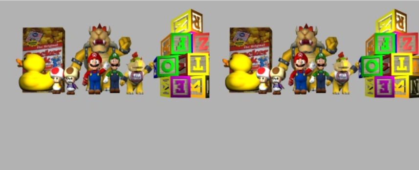
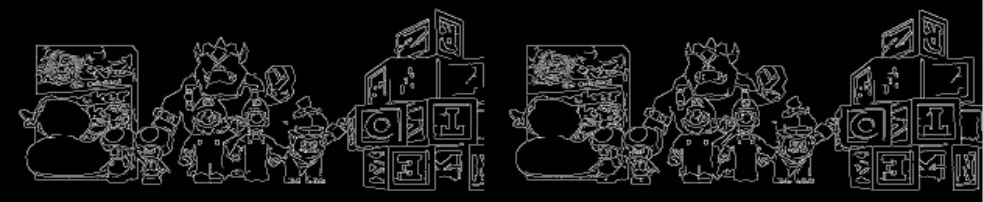
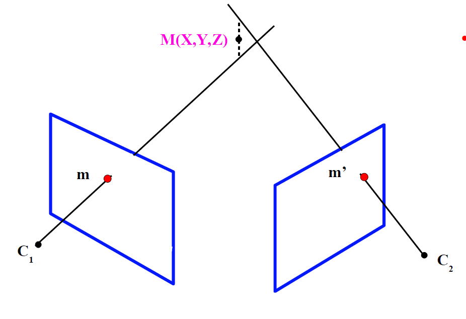
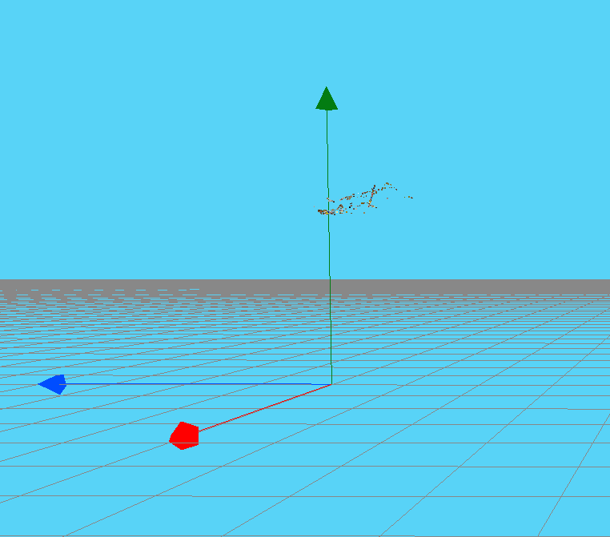
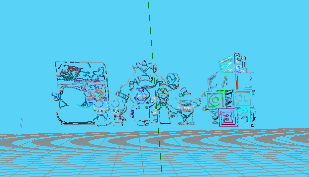
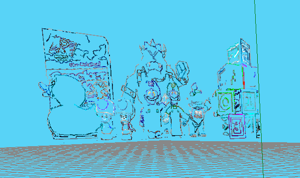
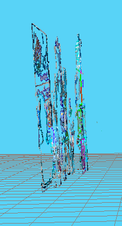
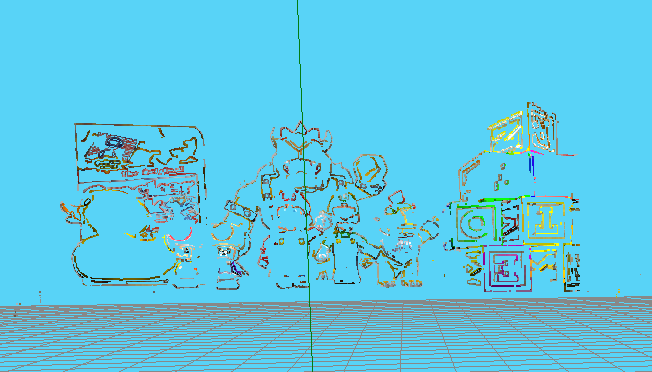

# Reconstrucción 3D

El objetivo de la práctica es la realización de la reconstrucción 3D de una escena a partir de un par-estéreo .

## Primeros pasos

Tenemos que tener algunos comandos a mano antes de empezar:

* Obtención de imágenes

  ```python
  HAL.getImage()
  ```

* Mostrar imágenes

  ```python
  GUI.showImage(imgage)
  ```

* Cambio de coordenadas de la imagen a coordenadas de la cámara

  ```python
  HAL.graficToOptical('left',point2d_homogeneo)
  ```

* Cambio de coordenadas de la cámara a coordenadas de la imagen

  ```python
  HAL.opticalToGrafic('left',point3d_homogeneo)
  ```

* Calcula la proyección de un punto 3d a un plano imagen.

  ```python
  HAL.project('left', point3d)
  ```

* Calcula un punto en la línea de retroproyección

  ```python
  HAL.backproject('left',point2d)
  ```

* Convierte un punto 3D del eje de coordenadas a un punto 3D de la escena

  ```python
  HAL.project3DScene(point3d)
  ```

## Solución propuesta

Se parte del siguiente conjunto de imágenes.



### Preprocesamiento de imágenes

Primeramente se deben preprocesar las imágenes para obtener los bordes de estas. Para ello se realiza un filtrado por Canny. 



### Retroproyección y línea epipolar

Se calcular la retroproyección de todos los puntos que son borde. Para ello se comprueba si el pixel es borde o no. En caso de ser borde se calcula se transforma el pixel de las coordenadas de la imagen (píxeles) a las coordenadas de la cámara. Cuando se tiene el pixel en coordenadas de la cámara se realiza la retroproyección y se obtiene un punto 3D. 

Con este punto 3D y la posición de la cámara se puede calcular el vector director de la recta de retroproyección. La recta de retroproyección tendrá la forma

```math
p = (point3d_{backpropagate} - pos_{camara})*alpha + pos_{camara}
```

Siendo `point3d_{backpropagate}` el punto 3d calculado con la retroproyección, `pos_{camara}` la posición de la cámara a la que pertenece el pixel y `alpha` un multiplicador del vector director.

Dada esta recta se calculan dos puntos de la misma. Estos dos puntos se proyectan sobre la otra cámara obteniendo la __recta de retroproyección__. Una vez se tienen las proyecciones de los puntos en la cámara derecha se deben pasar de las coordenadas de la cámara a coordenadas de la imagen (píxeles). Con los puntos de la retroproyección en la imagen se calcula la recta de retroproyección. A esta recta se le denomina __recta epipolar__. Esta recta epipolar tendrá el grosor del parche. 

### MatchTemplate

Se calcula el parche respecto a la imagen izquierda y se realiza busca en el resultado de combinar la imagen derecha con la línea epipolar. Si el _MatchTemplate_ se realiza con éxito se tendrá un coeficiente "coeff" que será superior a '0.9'. Si este proceso se realiza con las imágenes en HSV y se emplean sólo las matrices de HS se nota una mejoría en el tiempo de cómputo de este paso obteniendo resultados muy similares a realizar el cómputo con imágenes BGR, aunque se obtienen algunos expureos.

### Cálculo de punto 3D

Para realizar el cálculo del punto 3D se resuelve el sistema Ax=b donde:

- A son las ecuaciones de los vectores directores de las rectas de retroproyección
- b son los puntos de origen de las rectas de retroproyección
- x es la solución al sistema

De esta forma x será el punto en 3D que resuelve el sistema. En la siguiente imagen se puede ver una ejemplificación gráfica del cruce de las retroproyecciones.



Imagen tomada de los apuntes de __José Miguel Buenaposada Biencinto__ correspondiente a la asignatura _Visión Tridimensional_ de _MUVA_.

### Resultados

Primeramente se obtenían los siguientes resultados que, como se ve, realizan una reconstrucción de la escena incorrecta. Esto se debe a una mala implementación sobre la función HAL.opticalToGrafic ya que las coordenadas del punto deben ser (y,x,1) en lugar de (x,y,1). 



Si se realiza el cambio y se computa se obtiene los siguientes resultados. La reconstrucción tiene un tamaño pequeño, pero reproduce correctamente la escena. sin perder mucho detalle.



Además, mantiene la profundidad de los objetos correctamente, aunque debido a las dimensiones de la escena es difícil de apreciar.



El tiempo para conseguir estos resultados es aproximadamente de 8 minutos pero disminuye a aproximadamente 6 minutos si se realiza el _matchTemplate_ con imágenes en HS, es decir, sólo las matrices de color y saturación del sistema de HSV. Estos tiempos se han obtenido con un i7-8700k a 4,7GHz y 32GB de RAM.

Por último, se realizó el cambio de BGR a RGB en los colores que se pintaban con los puntos. Sin embargo, al realizar el _matchTemplate_ con las imágenes en HSV se nota una pérdida de información con respecto a realizarlo con las imágenes en BGR que se puede apreciar notablemente tanto en la información visible en los cubos de la derecha como en la reconstrucción de los Toads (personajes de Mario Bros) y Mario.


